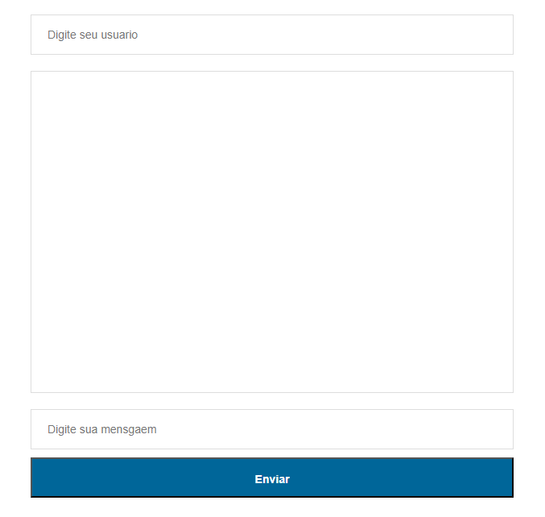

## Chat usando Socket.io

Em resulmo, o socket.io é responsavel por emitir e ler mensagens em forma da dados de um objeto, emitindo e recebendo entre os arquivos server.js e index.html, para evitar que as mensagens sumam ao atualizar a pagina foi feito um for que repassa todas as mensagens ai invés de usar localStorage.
